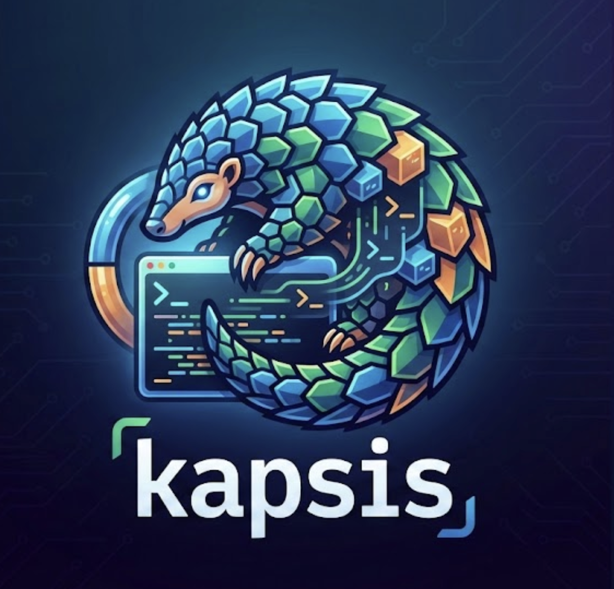

<p align="center">
  
</p>

<h1 align="center">Kapsis</h1>

<p align="center">
  <a href="https://github.com/aviadshiber/kapsis/actions/workflows/ci.yml"></a>
  <a href="https://github.com/aviadshiber/kapsis/actions/workflows/security.yml"></a>
  
</p>

<p align="center">
  <strong>Hermetically Isolated AI Agent Sandbox for Parallel Development</strong>
</p>

Kapsis enables running multiple AI coding agents in parallel on the same Maven project with complete isolation. Each agent runs in a Podman container with Copy-on-Write filesystem, ensuring Agent A's work cannot affect Agent B.

## Features

- **Agent Agnostic** - Works with Claude Code, Codex CLI, Aider, Gemini CLI, or any CLI-based agent
- **Agent Profiles** - Pre-built agent configurations with automatic container installation
- **Config-Driven** - Single YAML file defines agent command and filesystem whitelist
- **Copy-on-Write Filesystem** - Project files use overlay mounts (reads from host, writes isolated)
- **Maven Isolation** - Per-agent `.m2/repository`, blocked remote SNAPSHOTs, blocked deploy
- **Build Cache Isolation** - Gradle Enterprise remote cache disabled, per-agent local cache
- **Git Workflow** - Optional branch-based workflow with PR review feedback loop
- **SSH Security** - Automatic SSH host key verification for GitHub/GitLab/Bitbucket (enterprise servers supported)
- **Keychain Integration** - Automatic secret retrieval from macOS Keychain / Linux secret-tool
- **Status Reporting** - JSON-based progress tracking for external monitoring
- **Rootless Containers** - Security-hardened Podman rootless mode

## Installation

| Method | Command |
|--------|---------|
| **Homebrew** (recommended) | `brew install aviadshiber/kapsis/kapsis` |
| **Debian/Ubuntu** | `sudo dpkg -i kapsis_*.deb && sudo apt-get install -f` |
| **Fedora/RHEL** | `sudo dnf install kapsis-*.rpm` |
| **Universal script** | `curl -fsSL https://raw.githubusercontent.com/aviadshiber/kapsis/main/scripts/install.sh \| bash` |

> Download `.deb`/`.rpm` packages from the [releases page](https://github.com/aviadshiber/kapsis/releases).

See [docs/INSTALL.md](docs/INSTALL.md) for detailed instructions.

## Quick Start

```bash
# 1. Install Kapsis (using any method above, or clone directly)
git clone https://github.com/aviadshiber/kapsis.git && cd kapsis

# 2. Run setup (checks dependencies, optionally installs Podman)
./setup.sh              # Check dependencies only
./setup.sh --install    # Auto-install missing dependencies (Podman, etc.)

# 3. Build the container image
kapsis-build  # or ./scripts/build-image.sh

# 4. Copy and customize config
cp agent-sandbox.yaml.template agent-sandbox.yaml
# Edit agent-sandbox.yaml with your settings

# 5. Run an agent
kapsis 1 ~/project --task "fix failing tests"
# or: ./scripts/launch-agent.sh 1 ~/project --task "fix failing tests"
```

## Agent Profiles

Kapsis includes pre-built agent profiles that install the agent directly into the container image. This solves cross-platform compatibility issues (e.g., macOS binaries won't run in Linux containers).

### Build an Agent Image

```bash
# Build Claude CLI agent image
./scripts/build-agent-image.sh claude-cli

# Build Aider agent image
./scripts/build-agent-image.sh aider

# List available profiles
./scripts/build-agent-image.sh --help
```

### Use the Agent Image

```bash
# Use the pre-built agent image
./scripts/launch-agent.sh 1 ~/project \
    --image kapsis-claude-cli:latest \
    --task "implement rate limiting"

# Or specify in config
# image:
#   name: kapsis-claude-cli
#   tag: latest
```

### Available Profiles

| Profile | Agent | Installation |
|---------|-------|--------------|
| `claude-cli` | Claude Code CLI | `npm install -g @anthropic-ai/claude-code` |
| `claude-api` | Anthropic Python SDK | `pip install anthropic` |
| `aider` | Aider AI Pair Programmer | `pip install aider-chat` |

Profiles are defined in `configs/agents/`. Create custom profiles by copying an existing one.

## Usage

### Basic Usage

```bash
# Simple inline task
./scripts/launch-agent.sh 1 ~/project --task "fix failing tests in UserService"

# Complex task with spec file
./scripts/launch-agent.sh 1 ~/project --spec ./specs/feature.md

# Interactive mode (manual exploration)
./scripts/launch-agent.sh 1 ~/project --interactive
```

### Git Branch Workflow

```bash
# Create new branch and work on task
./scripts/launch-agent.sh 1 ~/project \
    --branch feature/DEV-123 \
    --spec ./specs/task.md

# Agent works, commits, pushes → PR created
# Review PR, request changes
# Update spec with feedback, re-run:

./scripts/launch-agent.sh 1 ~/project \
    --branch feature/DEV-123 \
    --spec ./specs/task-v2.md

# Agent CONTINUES from remote branch state!
```

### Parallel Agents

```bash
# Run multiple agents on same project, different branches
./scripts/launch-agent.sh 1 ~/project \
    --config configs/claude.yaml \
    --branch feature/DEV-123-api \
    --spec ./specs/api.md &

./scripts/launch-agent.sh 2 ~/project \
    --config configs/codex.yaml \
    --branch feature/DEV-123-ui \
    --spec ./specs/ui.md &

./scripts/launch-agent.sh 3 ~/project \
    --config configs/aider.yaml \
    --branch feature/DEV-123-tests \
    --spec ./specs/tests.md &

wait
```

### Monitor Agent Progress

```bash
# List all running agents
./scripts/kapsis-status.sh

# Get specific agent status
./scripts/kapsis-status.sh products 1

# Watch mode (live updates)
./scripts/kapsis-status.sh --watch

# JSON output for scripting
./scripts/kapsis-status.sh --json
```

Status files are written to `~/.kapsis/status/` in JSON format, enabling external tools to monitor agent progress.

## Configuration

Create `agent-sandbox.yaml` from the template:

```yaml
agent:
  # Command to launch the agent
  command: "claude --dangerously-skip-permissions -p \"$(cat /task-spec.md)\""
  workdir: /workspace

filesystem:
  include:
    - ~/.gitconfig
    - ~/.ssh
    - ~/.claude

environment:
  # Secrets from system keychain (macOS Keychain / Linux secret-tool)
  # No manual 'export' needed - retrieved automatically at launch!
  keychain:
    ANTHROPIC_API_KEY:
      service: "Claude Code-credentials"  # As stored by 'claude login'

  # Non-secret variables from host environment
  passthrough:
    - HOME
    - USER

resources:
  memory: 8g
  cpus: 4

maven:
  mirror_url: "https://your-artifactory.com/maven"
  block_remote_snapshots: true
  block_deploy: true

git:
  auto_push:
    enabled: true
```

See [docs/CONFIG-REFERENCE.md](docs/CONFIG-REFERENCE.md) for full configuration options.

## Supported Agents

| Agent | Command Example |
|-------|-----------------|
| Claude Code | `claude --dangerously-skip-permissions -p "$(cat /task-spec.md)"` |
| Codex CLI | `codex --approval-mode full-auto "$(cat /task-spec.md)"` |
| Aider | `aider --yes-always --message-file /task-spec.md` |
| Gemini CLI | `gemini -s docker "$(cat /task-spec.md)"` |
| Custom | Any CLI command |

Pre-built configs available in `configs/` directory.

## Isolation Guarantees

| Resource | Isolation Method |
|----------|------------------|
| Project files | Overlay mount (`:O`) - reads from host, writes to isolated upper layer |
| Maven repository | Per-agent container volume |
| Remote SNAPSHOTs | Blocked in isolated-settings.xml |
| Deploy operations | Blocked in isolated-settings.xml |
| GE/Develocity cache | Remote cache disabled |
| Host system | Podman rootless container |

## Cleanup

Reclaim disk space after agent work:

```bash
./scripts/kapsis-cleanup.sh --dry-run    # Preview
./scripts/kapsis-cleanup.sh --all        # Clean everything
```

See [docs/CLEANUP.md](docs/CLEANUP.md) for full options and troubleshooting.

## Troubleshooting

### Debug Logging

```bash
# Enable debug output
KAPSIS_DEBUG=1 ./scripts/launch-agent.sh 1 ~/project --task "test"

# View logs
tail -f ~/.kapsis/logs/kapsis-launch-agent.log
```

### Run Tests

```bash
./tests/run-all-tests.sh --quick    # Fast validation (~10s)
./tests/run-all-tests.sh -q         # All tests, quiet output
```

See [CONTRIBUTING.md](CONTRIBUTING.md) for the full logging configuration and test framework documentation.

## Project Structure

```
kapsis/
├── agent-sandbox.yaml.template  # Config template
├── CONTRIBUTING.md              # Testing & logging guide
├── Containerfile                # Container image definition
├── setup.sh                     # System setup and validation
├── quick-start.sh               # Simplified agent launcher
├── configs/
│   ├── agents/                  # Agent profile definitions
│   │   ├── claude-cli.yaml      # Claude Code CLI via npm
│   │   ├── claude-api.yaml      # Anthropic Python SDK
│   │   └── aider.yaml           # Aider AI pair programmer
│   ├── claude.yaml              # User configs (reference profiles)
│   ├── codex.yaml
│   ├── aider.yaml
│   └── interactive.yaml
├── scripts/
│   ├── launch-agent.sh          # Main launch script
│   ├── kapsis-status.sh         # Status query CLI tool
│   ├── kapsis-cleanup.sh        # Cleanup and reclaim disk space
│   ├── build-image.sh           # Build base container image
│   ├── build-agent-image.sh     # Build agent-specific images
│   ├── worktree-manager.sh      # Git worktree management
│   ├── post-container-git.sh    # Post-container git operations
│   ├── merge-changes.sh         # Manual merge workflow
│   ├── entrypoint.sh            # Container entrypoint
│   ├── init-git-branch.sh       # Git branch initialization
│   ├── post-exit-git.sh         # Post-exit commit/push
│   ├── switch-java.sh           # Java version switcher
│   └── lib/
│       ├── logging.sh           # Shared logging library
│       ├── status.sh            # Status reporting library
│       └── json-utils.sh        # JSON parsing utilities
├── maven/
│   └── isolated-settings.xml    # Maven isolation settings
├── docs/
│   ├── ARCHITECTURE.md
│   ├── CONFIG-REFERENCE.md
│   ├── GIT-WORKFLOW.md
│   └── designs/                 # Architecture design documents
│       └── agent-profiles-architecture.md
└── tests/                       # Validation tests
```

## Requirements

- **Podman** 4.0+ (5.0+ recommended) — automatically installed by `./setup.sh --install`
- **macOS** with Apple Silicon (tested) or Linux
- **Git** 2.0+
- **yq** (optional, for config parsing)

## License

MIT
