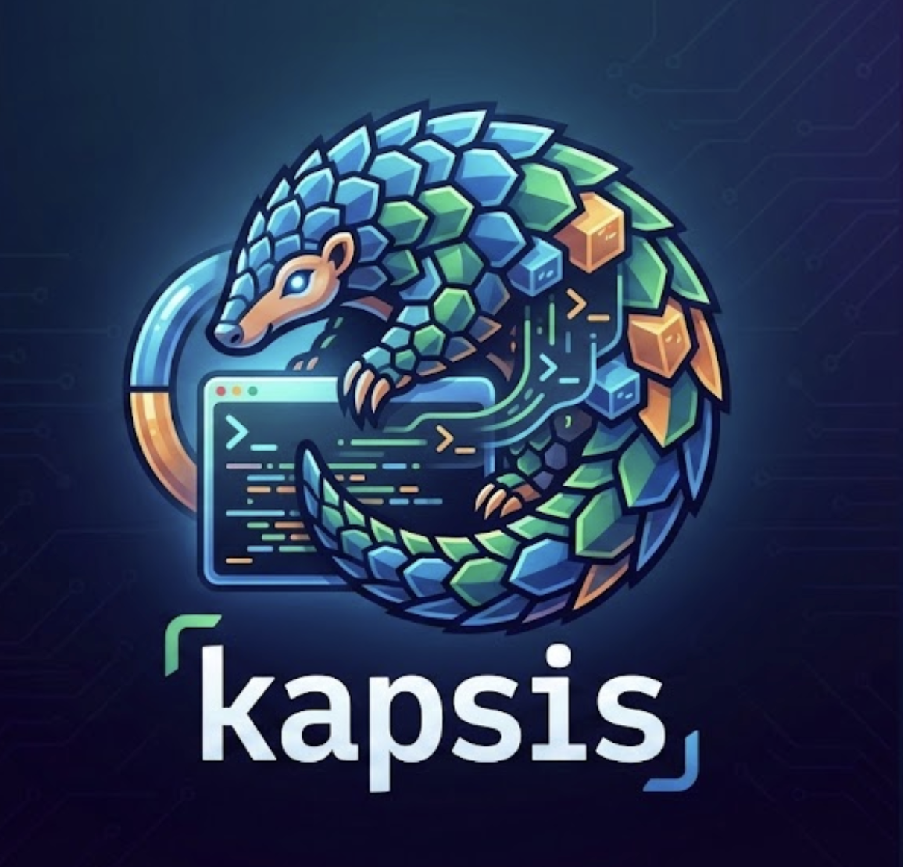

<p align="center">
  
</p>

<h1 align="center">Kapsis</h1>

<p align="center">
  <a href="https://github.com/aviadshiber/kapsis/actions/workflows/ci.yml"></a>
  <a href="https://github.com/aviadshiber/kapsis/actions/workflows/security.yml"></a>
  
</p>

<p align="center">
  <strong>Hermetically Isolated AI Agent Sandbox for Parallel Development</strong>
</p>

Kapsis enables running multiple AI coding agents in parallel on the same project with complete isolation. Each agent runs in a Podman container (or Kubernetes Pod) with Copy-on-Write filesystem, ensuring Agent A's work cannot affect Agent B.

## Features

### Isolation & Security

- **Agent Agnostic** - Pre-built profiles for Claude Code, Codex CLI, Aider, and Gemini CLI — or any CLI-based agent
- **Config-Driven** - Single YAML file defines agent command and filesystem whitelist
- **Copy-on-Write Filesystem** - Project files use overlay mounts or git worktrees (reads from host, writes isolated)
- **Network Isolation** - DNS-based allowlist filtering with IP pinning (default), blocks unauthorized network access
- **Maven Isolation** - Per-agent `.m2/repository`, blocked remote SNAPSHOTs, blocked deploy
- **Build Cache Isolation** - Gradle Enterprise remote cache disabled, per-agent local cache
- **SSH Security** - Automatic SSH host key verification for GitHub/GitLab/Bitbucket (enterprise servers supported)
- **Keychain Integration** - Automatic secret retrieval and injection from macOS Keychain / Linux secret-tool
- **Rootless Containers** - Security-hardened Podman rootless mode with seccomp and capability dropping
- **File Sanitization** - Homoglyph detection and binary filtering for mounted files
- **Tamper-Evident Audit Trail** - Hash-chained JSONL event logs with real-time suspicious-pattern detection

### Workflow & Scale

- **Git Workflow** - Optional branch-based workflow with PR review feedback loop
- **Kubernetes Backend** - Run agents as K8s Pods via the `AgentRequest` CRD and in-cluster operator (`--backend k8s`)
- **Plugin & LSP Injection** - Claude Code plugin hooks and LSP server configs injected into the container automatically

### Observability & Reliability

- **Web Dashboard** - Local single-binary dashboard: live agent list, health, logs, audit, conversations, disk usage, kill/cleanup controls
- **Status Reporting** - JSON-based progress tracking for external monitoring (`kapsis-status --watch`)
- **Conversation Transcripts** - Full agent output persisted to `~/.kapsis/conversations/<agent-id>/` for every run
- **`kapsis-ctl`** - Host-side container queries and control (inspect, list, alive, stop, logs, cp) via the libpod REST API
- **Liveness Monitoring** - Hung-agent detection with multi-signal probes (status staleness, process I/O, TCP activity) and auto-kill
- **Mount-Failure Watchdogs** - virtio-fs drop detection across the full lifecycle (pre-launch probe, vfkit watchdog, exec-channel watchdog)
- **Structured Recovery** - Machine-readable exit codes and `error_type` field, plus `kapsis-recovery-action` for retry decisions
- **TTL-Based Cleanup** - Automatic snapshot/conversation expiry and disk pressure warnings

## Installation

| Method | Command |
|--------|---------|
| **Homebrew** (recommended) | `brew tap aviadshiber/kapsis && brew install kapsis` |
| **Debian/Ubuntu** | `sudo dpkg -i kapsis_*.deb && sudo apt-get install -f` |
| **Fedora/RHEL** | `sudo dnf install kapsis-*.rpm` |
| **Universal script** | `curl -fsSL https://raw.githubusercontent.com/aviadshiber/kapsis/main/scripts/install.sh \| bash` |

> Download `.deb`/`.rpm` packages from the [releases page](https://github.com/aviadshiber/kapsis/releases).

See [docs/INSTALL.md](docs/INSTALL.md) for detailed instructions.

### Version Management

```bash
# Check current version
kapsis --version

# Check if upgrade is available
kapsis --check-upgrade

# Upgrade to latest version
kapsis --upgrade

# Upgrade to specific version
kapsis --upgrade 2.34.0

# Downgrade to previous version
kapsis --downgrade

# Downgrade to specific version
kapsis --downgrade 2.33.1

# Preview upgrade/downgrade without executing
kapsis --upgrade --dry-run
kapsis --downgrade --dry-run
```

## Quick Start

```bash
# 1. Install Kapsis (using any method above, or clone directly)
git clone https://github.com/aviadshiber/kapsis.git && cd kapsis

# 2. Run setup (checks dependencies, optionally installs Podman)
./setup.sh              # Check dependencies only
./setup.sh --install    # Auto-install missing dependencies (Podman, etc.)

# 3. Pull pre-built container images
./scripts/build-image.sh --pull
./scripts/build-agent-image.sh claude-cli --pull

# 4. Copy and customize config
cp agent-sandbox.yaml.template agent-sandbox.yaml
# Edit agent-sandbox.yaml with your settings

# 5. Run an agent
kapsis 1 ~/project --task "fix failing tests"
# or: ./scripts/launch-agent.sh ~/project --task "fix failing tests"
```

> **Note:** Omit `--pull` to build images locally if you need custom configurations.

## Agent Profiles

Kapsis includes pre-built agent profiles that install the agent directly into the container image. This solves cross-platform compatibility issues (e.g., macOS binaries won't run in Linux containers).

### Build an Agent Image

```bash
# Build Claude CLI agent image
./scripts/build-agent-image.sh claude-cli

# Build Aider agent image
./scripts/build-agent-image.sh aider

# List available profiles
./scripts/build-agent-image.sh --help
```

### Use the Agent Image

```bash
# Use the pre-built agent image
./scripts/launch-agent.sh ~/project \
    --image kapsis-claude-cli:latest \
    --task "implement rate limiting"

# Or specify in config
# image:
#   name: kapsis-claude-cli
#   tag: latest
```

### Available Profiles

| Profile | Agent | Installation |
|---------|-------|--------------|
| `claude-cli` | Claude Code CLI | Native installer (`curl -fsSL https://claude.ai/install.sh`) |
| `claude-api` | Anthropic Python SDK | `pip install anthropic` |
| `aider` | Aider AI Pair Programmer | `pip install aider-chat` |
| `codex-cli` | OpenAI Codex CLI | `npm install -g @openai/codex` |
| `gemini-cli` | Google Gemini CLI | `npm install -g @google/gemini-cli` |

Profiles are defined in `configs/agents/`. Create custom profiles by copying an existing one.

## Usage

### Basic Usage

```bash
# Simple inline task
./scripts/launch-agent.sh ~/project --task "fix failing tests in UserService"

# Complex task with spec file
./scripts/launch-agent.sh ~/project --spec ./specs/feature.md

# Interactive mode (manual exploration)
./scripts/launch-agent.sh ~/project --interactive
```

### Git Branch Workflow

```bash
# Create new branch and work on task
./scripts/launch-agent.sh ~/project \
    --branch feature/DEV-123 \
    --spec ./specs/task.md

# Agent works, commits, pushes → PR created
# Review PR, request changes
# Update spec with feedback, re-run:

./scripts/launch-agent.sh ~/project \
    --branch feature/DEV-123 \
    --spec ./specs/task-v2.md

# Agent CONTINUES from remote branch state!
```

### Parallel Agents

```bash
# Run multiple agents on same project, different branches
./scripts/launch-agent.sh ~/project \
    --config configs/claude.yaml \
    --branch feature/DEV-123-api \
    --spec ./specs/api.md &

./scripts/launch-agent.sh ~/project \
    --config configs/codex.yaml \
    --branch feature/DEV-123-ui \
    --spec ./specs/ui.md &

./scripts/launch-agent.sh ~/project \
    --config configs/aider.yaml \
    --branch feature/DEV-123-tests \
    --spec ./specs/tests.md &

wait
```

### Isolation Modes

Kapsis supports two isolation modes for the project filesystem:

| Mode | Flag | When Used | Best For |
|------|------|-----------|----------|
| **Worktree** | `--worktree-mode` | Auto when `--branch` + git repo | Git-based projects, PR workflows |
| **Overlay** | `--overlay-mode` | Auto when no branch specified | Non-git projects, quick tasks |

```bash
# Worktree mode (recommended for git projects)
# Creates isolated git worktree, real commits, pushable branches
./scripts/launch-agent.sh ~/project --branch feature/task --task "..."

# Overlay mode (legacy)
# Uses fuse-overlayfs, writes go to ephemeral upper layer
./scripts/launch-agent.sh ~/project --task "quick exploration"

# Force specific mode
./scripts/launch-agent.sh ~/project --worktree-mode --branch feature/x --task "..."
./scripts/launch-agent.sh ~/project --overlay-mode --task "..."
```

See [docs/GIT-WORKFLOW.md](docs/GIT-WORKFLOW.md) for detailed comparison.

### Kubernetes Backend

Run agents as Kubernetes Pods instead of local containers — same flags, same isolation model, cluster-scale concurrency:

```bash
# Submit an AgentRequest CR to the cluster
./scripts/launch-agent.sh ~/project --backend k8s --task "implement feature"

# Preview the generated CR YAML without applying it
./scripts/launch-agent.sh ~/project --backend k8s --task "..." --dry-run
```

An in-cluster operator (Go, kubebuilder) reconciles `AgentRequest` CRDs into Jobs with a status sidecar, enforces per-pod NetworkPolicy based on the network mode, and bridges agent status back into the CR. See [docs/K8S-BACKEND.md](docs/K8S-BACKEND.md).

### Monitor Agent Progress

```bash
# List all running agents
./scripts/kapsis-status.sh

# Get specific agent status
./scripts/kapsis-status.sh products 1

# Watch mode (live updates)
./scripts/kapsis-status.sh --watch

# JSON output for scripting
./scripts/kapsis-status.sh --json
```

Status files are written to `~/.kapsis/status/` in JSON format, enabling external tools to monitor agent progress.

### Web Dashboard

A local web dashboard (single self-contained binary, no runtime dependencies) visualizes everything in `~/.kapsis/`: live agent list with composite health, per-agent logs, spec, activity timeline, audit trail with hash-chain verification, conversation transcripts, container stats, disk usage breakdown, and maintenance controls (kill agent, run cleanup).

```bash
# Installed via Homebrew/packages alongside kapsis
kapsis-dashboard --open          # start on 127.0.0.1:7777 and open browser

# Or build from source
cd dashboard && bun install && bun run compile
./dashboard/bin/kapsis-dashboard --open
```

The dashboard binds to localhost only and protects every request with a bearer token. Destructive actions (kill/cleanup) require a typed confirmation and are themselves audited. Use `--read-only` to disable them entirely. See [docs/DASHBOARD.md](docs/DASHBOARD.md).

### kapsis-ctl (Container Queries & Control)

`kapsis-ctl` is a host-side Go binary that talks to the Podman libpod REST API directly — a reliable alternative to the `podman` CLI for scripts and orchestrators:

```bash
make build-ctl                          # builds ./bin/kapsis-ctl

kapsis-ctl list --filter name=kapsis    # JSON array of containers
kapsis-ctl inspect kapsis-a3f2b1        # container metadata (secrets excluded)
kapsis-ctl alive kapsis-a3f2b1          # exit 0 if running, 1 otherwise
kapsis-ctl stop -t 10 kapsis-a3f2b1     # graceful SIGTERM→SIGKILL stop
kapsis-ctl logs -f kapsis-a3f2b1        # stream container logs
kapsis-ctl cp kapsis-a3f2b1:/workspace/report.md ./out   # copy files out
```

### Conversation Transcripts

Every run persists the agent's full output (ANSI-stripped) to `~/.kapsis/conversations/<agent-id>/transcript.txt` — including on abnormal exits — so you can review what an agent did after the container is gone. Transcripts are capped at 50 MB and expire after 7 days via `kapsis-cleanup`.

## Configuration

Create `agent-sandbox.yaml` from the template:

```yaml
agent:
  # Command to launch the agent
  command: "claude --dangerously-skip-permissions -p \"$(cat /task-spec.md)\""
  workdir: /workspace

filesystem:
  include:
    - ~/.gitconfig
    - ~/.ssh
    - ~/.claude

environment:
  # Secrets from system keychain (macOS Keychain / Linux secret-tool)
  # No manual 'export' needed - retrieved automatically at launch!
  keychain:
    ANTHROPIC_API_KEY:
      service: "Claude Code-credentials"  # As stored by 'claude login'

  # Non-secret variables from host environment
  passthrough:
    - HOME
    - USER

resources:
  memory: 8g
  cpus: 4

maven:
  mirror_url: "https://your-artifactory.com/maven"
  block_remote_snapshots: true
  block_deploy: true

git:
  auto_push:
    enabled: true
```

See [docs/CONFIG-REFERENCE.md](docs/CONFIG-REFERENCE.md) for full configuration options.

## Supported Agents

| Agent | Profile | Command Example |
|-------|---------|-----------------|
| Claude Code | `claude-cli` | `claude --dangerously-skip-permissions -p "$(cat /task-spec.md)"` |
| Codex CLI | `codex-cli` | `codex --approval-mode full-auto "$(cat /task-spec.md)"` |
| Aider | `aider` | `aider --yes-always --message-file /task-spec.md` |
| Gemini CLI | `gemini-cli` | `gemini -s docker "$(cat /task-spec.md)"` |
| Custom | — | Any CLI command |

Pre-built configs available in `configs/` directory.

## Build Configuration

Customize container images for your specific needs using build profiles:

```bash
# Build minimal image (~500MB) - base container only
./scripts/build-image.sh --profile minimal

# Build Java development image (~1.5GB)
./scripts/build-image.sh --profile java-dev

# Build full-stack image (~2.1GB) - Java, Node.js, Python
./scripts/build-image.sh --profile full-stack

# Preview build configuration
./scripts/build-image.sh --profile java-dev --dry-run
```

### Available Profiles

| Profile | Est. Size | Languages | Best For |
|---------|-----------|-----------|----------|
| `minimal` | ~500MB | None | Shell scripts, basic tasks |
| `java-dev` | ~1.5GB | Java 17/8 | Java development |
| `java8-legacy` | ~1.4GB | Java 8 | Legacy Java projects |
| `full-stack` | ~2.1GB | Java, Node.js, Python | Multi-language projects |
| `backend-go` | ~1.3GB | Go, Python | Go backend services |
| `backend-rust` | ~1.4GB | Rust, Python | Rust backend services |
| `frontend` | ~1.2GB | Node.js, Rust | Frontend/WebAssembly |
| `ml-python` | ~1.8GB | Python, Node.js, Rust | Machine learning projects |

### Configure Dependencies

Use the interactive CLI or flags:

```bash
# Interactive mode
./scripts/configure-deps.sh

# Non-interactive (for AI agents)
./scripts/configure-deps.sh --profile java-dev --json

# Custom configuration
./scripts/configure-deps.sh --enable rust --disable nodejs
```

See [docs/BUILD-CONFIGURATION.md](docs/BUILD-CONFIGURATION.md) for full documentation.

## Isolation Guarantees

| Resource | Isolation Method |
|----------|------------------|
| Project files | Overlay mount (`:O`) - reads from host, writes to isolated upper layer |
| Maven repository | Per-agent container volume |
| Remote SNAPSHOTs | Blocked in isolated-settings.xml |
| Deploy operations | Blocked in isolated-settings.xml |
| GE/Develocity cache | Remote cache disabled |
| Host system | Podman rootless container |
| Network access | DNS-based allowlist filtering (default) |

### Network Isolation

Kapsis provides DNS-based network filtering by default, allowing agents to access only whitelisted domains:

```bash
# Default: filtered mode (DNS allowlist)
kapsis ~/project --task "implement feature"

# Maximum isolation (no network)
kapsis ~/project --network-mode none --task "refactor code"

# Unrestricted network (use sparingly)
kapsis ~/project --network-mode open --task "test"
```

See [docs/NETWORK-ISOLATION.md](docs/NETWORK-ISOLATION.md) for customizing the allowlist.

### Security Hardening

Kapsis provides security profiles with increasing levels of container hardening:

```bash
# Default: standard profile + seccomp (capability dropping, syscall filtering)
kapsis ~/project --task "implement feature"

# Strict mode for untrusted execution (adds noexec /tmp, lower PID limit)
kapsis ~/project --security-profile strict --task "review external PR"

# Trusted execution (no restrictions, isolated network)
kapsis ~/project --security-profile minimal --network-mode none --task "run trusted task"
```

| Profile | Protection Level | Use Case |
|---------|-----------------|----------|
| `minimal` | None | Trusted execution |
| `standard` | Capabilities, privilege escalation | Base profile |
| `strict` | + Seccomp filtering, noexec /tmp | Untrusted execution |
| `paranoid` | + Read-only root, LSM required | Maximum security |

See [docs/SECURITY-HARDENING.md](docs/SECURITY-HARDENING.md) for detailed configuration.

### Audit Trail

Every agent action can be recorded as a hash-chained JSONL event log — each event links to the previous via SHA-256, so any tampering breaks the chain. Real-time pattern detection flags credential exfiltration attempts, mass deletions, and suspicious commands as they happen.

```bash
# Enable per run (or set audit.enabled: true in YAML)
KAPSIS_AUDIT_ENABLED=true kapsis ~/project --task "..."

# Post-run report: timeline, statistics, alerts, chain verification
./scripts/audit-report.sh --latest --verify
```

See [docs/AUDIT-SYSTEM.md](docs/AUDIT-SYSTEM.md).

## Reliability & Recovery

Kapsis is built to run unattended. A layered watchdog stack detects hung agents and infrastructure failures, and every outcome is reported with a machine-readable exit code and `error_type` so orchestrators can decide what to do next without guessing:

- **Liveness monitor** — multi-signal hung-agent detection (status staleness, process-tree I/O, TCP connection quality) with bounded grace periods and auto-diagnostics before kill
- **Mount-failure detection** — virtio-fs drops are caught pre-launch (host probe), at container startup, and mid-run (vfkit watchdog, exec-channel watchdog) on macOS
- **Partial-work awareness** — if a crashed agent's work was already committed, `error_type` is `agent_partial` so callers don't blindly retry and duplicate work

| Exit Code | Meaning |
|-----------|---------|
| 0 | Success (changes committed or no changes) |
| 1 | Agent failure (`error_type` distinguishes `agent_failure` vs `agent_partial`) |
| 2 | Push failed (a ready-to-run `KAPSIS_PUSH_FALLBACK` command is printed and stored in status.json) |
| 3 | Uncommitted changes remain |
| 4 | Mount failure (virtio-fs drop or exec-channel hang) |
| 5 | Agent completed but process hung (killed by liveness monitor) |
| 6 | Commit failed (worktree preserved with staged changes for manual recovery) |

The `kapsis-recovery-action` script maps `error_type` to a recommended action (retry / retry push / restart VM / notify human):

```bash
kapsis-recovery-action myproject 42        # exit code encodes the action
kapsis-recovery-action --json myproject 42 # rich JSON with next_steps
```

See [docs/STATUS-TRACKING.md](docs/STATUS-TRACKING.md) for the full `error_type` reference.

## Cleanup

Reclaim disk space after agent work:

```bash
./scripts/kapsis-cleanup.sh --dry-run    # Preview
./scripts/kapsis-cleanup.sh --all        # Clean everything
./scripts/kapsis-cleanup.sh --vm-health  # Podman VM inode/disk monitoring (macOS)
```

Default runs also expire leaked per-agent snapshots (14-day TTL) and conversation transcripts (7-day TTL), and warn when `~/.kapsis/` exceeds a configurable size threshold (50 GB default) with a breakdown of the top consumers.

See [docs/CLEANUP.md](docs/CLEANUP.md) for full options and troubleshooting.

## Troubleshooting

### Debug Logging

```bash
# Enable debug output
KAPSIS_DEBUG=1 ./scripts/launch-agent.sh ~/project --task "test"

# View logs
tail -f ~/.kapsis/logs/kapsis-launch-agent.log
```

### Run Tests

```bash
./tests/run-all-tests.sh --quick    # Fast validation (~10s)
./tests/run-all-tests.sh -q         # All tests, quiet output
```

See [CONTRIBUTING.md](CONTRIBUTING.md) for the full logging configuration and test framework documentation.

### Corporate / Domain-Joined Hosts (AD / LDAP)

On macOS hosts where the user is an Active Directory or LDAP domain account, `id -u` typically returns a 10-digit UID (>1 billion). The default `--userns=keep-id` resolver in podman intermittently produces a degenerate user namespace mapping that doesn't include the container's `developer` user (UID 1000), causing launches to fail with exit 126:

```
Error: preparing container <hash> for attach: container uses ID mappings
(...), but doesn't map UID 1000
```

Kapsis autodetects this case and uses `--userns=keep-id:uid=1000,gid=1000` when the host UID exceeds 60000 (the POSIX `UID_MAX` convention). No action is required for most users.

To override:

```yaml
# In your agent config (e.g. configs/claude.yaml):
security:
  userns: keep-id:uid=1000,gid=1000   # force the explicit form
  # userns: keep-id                   # force plain keep-id (don't use on domain hosts)
  # userns: auto                      # podman auto-allocate (caveat: subuid pool limit)
  # userns: host                      # no userns isolation (debug only)
```

Or set the `KAPSIS_USERNS` environment variable for a session-local override (highest precedence).

See [kapsis#361](https://github.com/aviadshiber/kapsis/issues/361) for the underlying podman/userns interaction.

## Documentation

| Document | Description |
|----------|-------------|
| [ARCHITECTURE.md](docs/ARCHITECTURE.md) | System design, data flows, and component interactions |
| [BUILD-CONFIGURATION.md](docs/BUILD-CONFIGURATION.md) | Customizing container images with build profiles |
| [CONFIG-REFERENCE.md](docs/CONFIG-REFERENCE.md) | Complete configuration options for agent-sandbox.yaml |
| [GIT-WORKFLOW.md](docs/GIT-WORKFLOW.md) | Branch-based workflow, worktree vs overlay modes |
| [STATUS-TRACKING.md](docs/STATUS-TRACKING.md) | Real-time progress monitoring, error types, and recovery |
| [DASHBOARD.md](docs/DASHBOARD.md) | Local web dashboard: agents, health, audit, disk, controls |
| [K8S-BACKEND.md](docs/K8S-BACKEND.md) | Kubernetes backend: AgentRequest CRD and operator |
| [AUDIT-SYSTEM.md](docs/AUDIT-SYSTEM.md) | Tamper-evident audit trail and pattern detection |
| [PLUGINS.md](docs/PLUGINS.md) | Claude Code plugin hook injection into containers |
| [INSTALL.md](docs/INSTALL.md) | Detailed installation instructions |
| [SETUP.md](docs/SETUP.md) | Initial setup and dependency configuration |
| [CLEANUP.md](docs/CLEANUP.md) | Disk space management, TTL cleanup, and VM health |
| [SECURITY-HARDENING.md](docs/SECURITY-HARDENING.md) | Container security design and hardening options |
| [NETWORK-ISOLATION.md](docs/NETWORK-ISOLATION.md) | Network security and isolation configuration |
| [GITHUB-SETUP.md](docs/GITHUB-SETUP.md) | GitHub integration and authentication |
| [TESTING.md](docs/TESTING.md) | Test tiers, conventions, and prerequisites |
| [TEST-COVERAGE-ANALYSIS.md](docs/TEST-COVERAGE-ANALYSIS.md) | Test coverage analysis and recommendations |
| [SECURITY-VULNERABILITY-SCAN.md](docs/SECURITY-VULNERABILITY-SCAN.md) | Security vulnerability scan report |
| [CONTRIBUTING.md](CONTRIBUTING.md) | Development guide, testing, and logging |

## Project Structure

```
kapsis/
├── agent-sandbox.yaml.template  # Config template
├── CONTRIBUTING.md              # Testing & logging guide
├── Containerfile                # Container image definition
├── Makefile                     # Build targets for kapsis-ctl
├── setup.sh                     # System setup and validation
├── quick-start.sh               # Simplified agent launcher
├── configs/
│   ├── agents/                  # Agent profile definitions
│   │   ├── claude-cli.yaml      # Claude Code CLI
│   │   ├── claude-api.yaml      # Anthropic Python SDK
│   │   ├── codex-cli.yaml       # OpenAI Codex CLI
│   │   ├── gemini-cli.yaml      # Google Gemini CLI
│   │   └── aider.yaml           # Aider AI pair programmer
│   ├── build-profiles/          # Container build profiles (minimal → full-stack)
│   ├── specs/                   # Task specification templates
│   ├── k8s/                     # K8s backend configs and examples
│   ├── network-allowlist.yaml   # DNS filtering allowlist
│   └── build-config.yaml        # Default build configuration
├── scripts/
│   ├── launch-agent.sh          # Main launch script
│   ├── kapsis-status.sh         # Status query CLI tool
│   ├── kapsis-cleanup.sh        # Cleanup, TTL expiry, disk reclamation
│   ├── kapsis-recovery-action.sh# Map error_type → recovery action
│   ├── audit-report.sh          # Audit report generation
│   ├── build-image.sh           # Build base container image
│   ├── build-agent-image.sh     # Build agent-specific images
│   ├── configure-deps.sh        # Configure container dependencies
│   ├── worktree-manager.sh      # Git worktree management
│   ├── post-container-git.sh    # Post-container git operations
│   ├── entrypoint.sh            # Container entrypoint
│   ├── backends/                # Backend implementations (podman.sh, k8s.sh)
│   ├── hooks/                   # Status/git hooks + agent adapters
│   └── lib/                     # Shared libraries (logging, status, security,
│                                #   audit, liveness-monitor, watchdogs, transcript, ...)
├── cmd/
│   └── kapsis-ctl/              # Host-side Podman query/control binary (Go)
├── operator/                    # K8s operator (Go, kubebuilder) for AgentRequest CRD
├── dashboard/                   # Local web dashboard (Bun + TypeScript + React)
│   ├── server/                  # HTTP/SSE server reading ~/.kapsis/ state
│   └── ui/                      # Vite + React SPA (embedded into single binary)
├── maven/
│   └── isolated-settings.xml    # Maven isolation settings
├── security/                    # AppArmor & seccomp profiles
├── packaging/                   # Homebrew, Debian, RPM packages
├── docs/                        # Extended documentation (see table above)
└── tests/                       # 100+ test files using tests/lib/test-framework.sh
```

## Requirements

- **Podman** 4.0+ (5.0+ recommended) — automatically installed by `./setup.sh --install`
- **macOS** with Apple Silicon (tested) or Linux
- **Git** 2.0+
- **yq** 4.0+ — required for YAML config parsing, agent image builds, and status hooks

Optional (only for building from source — release packages ship pre-built binaries):

- **Bun** — to develop or compile the web dashboard (`dashboard/`)
- **Go** 1.22+ — to build `kapsis-ctl` (`make build-ctl`) or the K8s operator

## License

MIT
